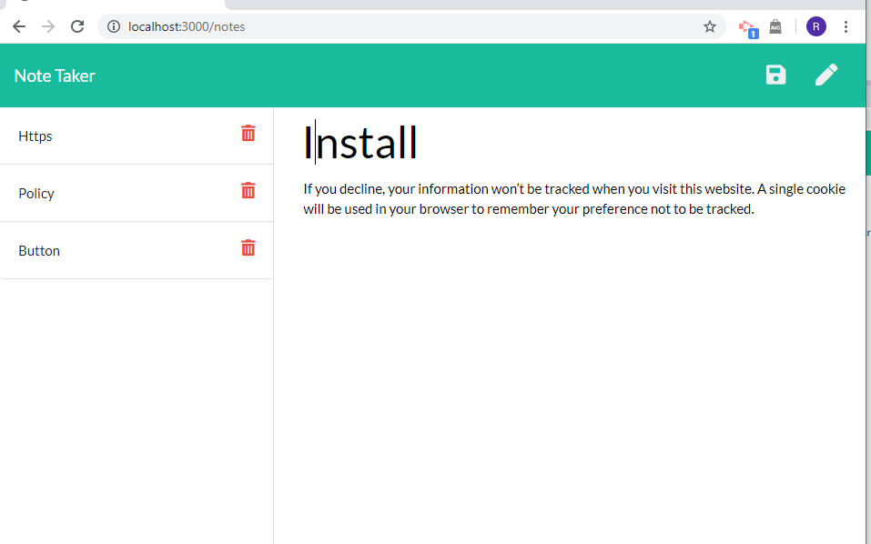

# : Note Taker

## description

Generate Team is a dynamically  generates ` Note Taker `   application. Node.js is used in this application And for run this app, ` NPM `  ,`path`, `uuid/v4` needs to install. Deploued to Heroku.

In this application users can save note  and open note for read in db.json file. Users can delete any othay wants.
____

##  Applications Uses in this projects
    * Html
    * css
    * Java Script
    * Node.js

## Instalation 

        $ npm install, 
        $ npm install gitignore -g
        $ npm install uuid4

[Heroku Link]()

## page view

